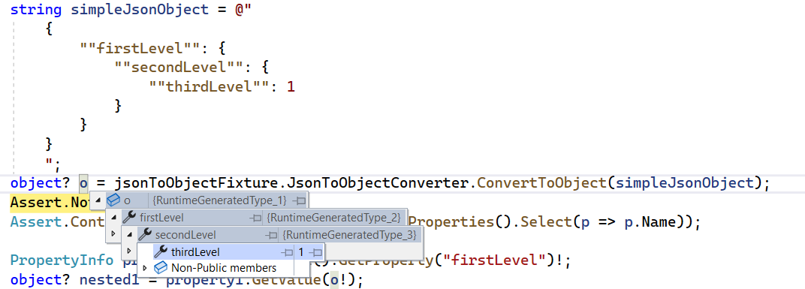

# JsonToObject

A C# utility to instantiate and hydrate CLR objects from Json strings.

CLR classes are built on the fly, mirroring the structure of the input JSON.

The resulting object's properties can be inspected and evaluated using reflection (this is useful in those cases in which the properties of the input object are not known in advance).

Here's an example, excerpted from one of the unit tests, showing how the resulting object can be inspected in Visual Studio:

Usage examples can be found in [JsonToObject.Tests/UsageExamples.cs](JsonToObject.Tests/UsageExamples.cs).
